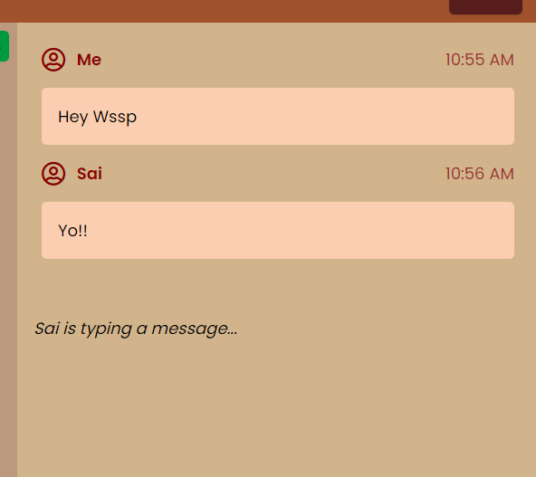

# Microsoft Teams Clone- Video Conferencing Web App

Under the microsoft Engage 2021 program made a video-chat app, where users can chat with both video and audio and implemented few features such as:

* Mute and Unmute button (Gives a notification when clicked).
* Video off and On (Gives a notification when clicked).
* ScreenShare option.
* Real Time chat where all other users get notified when someone is typing.
* **PING** info (Total round trip time from server to client).

## Submission for Microsoft Engage 2021 🌟

<a href="https://microsoft-teams-clone-guru.herokuapp.com/">
    LIVE DEMO
</a>

 

## Features and Interfaces
* Landing page when someone wants to join.   
* When someone joins all others in the room get notified.   
* User Interface when two users join.   
* When you on/off mic or camera, You get notified   
* When you click on ping You will get a popup.   
* When a user types a message all others can see that he is typing.   
* On clicking the invite button, You get a popup.   

## Tech stack

### Tools and Languages: 

  
  
 <a href="https://expressjs.com" target="_blank">  
  
  
 
 

## Points to remember while testing the app

1. Allow **permissions** for camera and mic
2. In case any **user is not broadcasted** it is probably due to server overload, **REFRESH** the window to solve this. 
3. Make sure the **URL** is starting with https 

## Instructions

1. `git clone https://github.com/GuruSaiKumar/Microsoft-Teams.git`
2. Install node dependencies 
   - `npm install` 
3. `npm start`
4. The app is now running at http://localhost:3000/

## Need help?

Feel free to contact me on [LinkedIn](https://www.linkedin.com/in/guru-sai-kumar/) 

 
